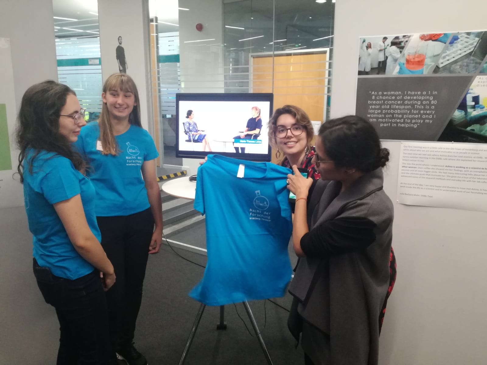

# EMBL Women in Science Project

***[EMBL = European Molecular Biology Laboratory](https://embl.de)***

*From July to September 2019, the 'Friends of EMBL' department is running a small project - 'Women in Science', with EMBL Teens, an EMBL club for high school students interested in life sciences. Each girl has been paired with a women researcher at EMBL where they will take mentorship roles as a mentee and mentor. The EMBL researcher will introduce their mentees to their research work, their life as a scientist and a few important skills that have been useful for them. At the European Researchers’ Night on 27 September 2019, an exhibition on this project will be organised to show the work carried out by different mentor-mentee pairs in the form of visual display, video or presentation.*

This page will be collaboratively developed by Maria-Theresa - an EMBL teen, who is learning about computational biology, data analysis, and artificial intelligence in her spare time, and Malvika Sharan - a computational biologist and community outreach coordinator at EMBL.

<blockquote class="twitter-tweet" data-lang="en-gb">
This summer I am mentoring a teenager from <a href="https://twitter.com/embl?ref_src=twsrc%5Etfw">@embl</a> teens as a part of a project called &quot;Women in Science&quot;.  She is learning some computation skills with me, while we also discuss various career paths in Science. We have started to record our journey here: <a href="https://t.co/XvcFLrN1ro">https://t.co/XvcFLrN1ro</a>
&mdash; Malvika Sharan (@MalvikaSharan) <a href="https://twitter.com/MalvikaSharan/status/1157256118432927746?ref_src=twsrc%5Etfw">2 August 2019</a></blockquote>

## Track Our Journey

- [Introduction to the project](./posts/2019-07-17-introduction.md)
- [Community & Collaboration](./posts/2019-07-30-community_collaboration.md)
- [Interview with the EMBL Teen](./posts/2019-07-31-matheli-interview.md)
- [Open Science & Unix](./posts/2019-08-02-open_science.md)
- [EMBL Archive & Git](./posts/2019-08-13-research_archive.md) - 14 August 2019

## Upcoming posts

- [Researcher's Night & Our Exhibition](./posts/2019-09-27-researcher_night.md) - 30 September 2019

## Learn more about

| [EMBL Teens](https://www.embl.de/leben/friends/en#embl-teens) | [Project from EMBL Teen's Perspective](https://matheli.github.io/Matheli/) |
